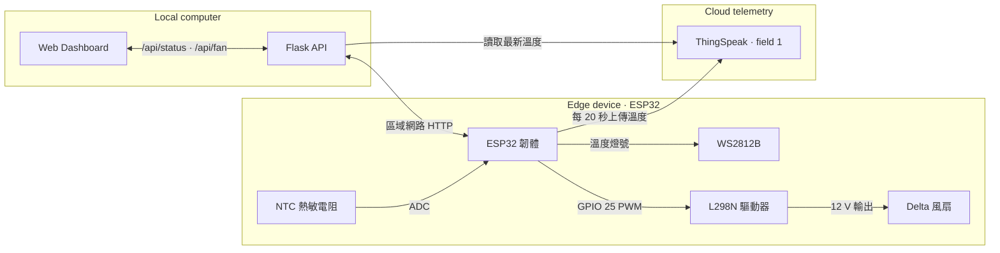
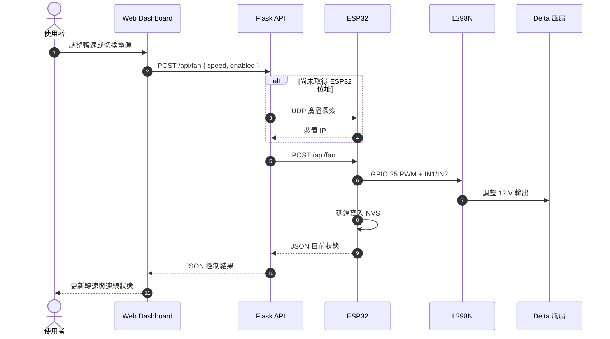

<div align="center">

# THERM CORE

**ESP32 × ThingSpeak × Flask 的散熱監控與風扇控制原型**


以網頁即時查看溫度趨勢，並透過區域網路控制 ESP32 與 Delta 風扇。

</div>

THERM CORE 是「無幫浦單相浸沒式冷卻結合熱管」研究構想的監控與控制介面原型。ESP32 負責量測、燈號與風扇輸出；ThingSpeak 保存溫度資料；Flask 則整合雲端讀值與區域網路控制，提供單一 Web Dashboard。

> [!IMPORTANT]
> 目前只有 ThingSpeak 溫度與 ESP32 風扇狀態是即時資料。晶片功耗、內部風扇功率與部分 PUE 計算採固定或推估值，不能直接作為正式實驗結果。

## 靜態展示

[`demo/index.html`](demo/index.html) 是不需要 Python、ThingSpeak 或 ESP32 的展示版本。它使用瀏覽器端模擬資料，可以直接雙擊開啟；滑桿、風扇開關、溫度曲線與 CSV 匯出均可操作，但不會控制真實硬體。

若要透過 GitHub Pages 展示：

1. 將專案 push 到 GitHub。
2. 進入儲存庫的 **Settings → Pages**。
3. 在 **Build and deployment** 選擇 **Deploy from a branch**。
4. 選擇 `main` 與 `/(root)` 後儲存。
5. 以 `https://<你的帳號>.github.io/<儲存庫名稱>/demo/` 開啟展示頁。

正式版本仍需執行 Flask，並透過環境變數與 `secrets.h` 連接 ThingSpeak 和 ESP32。

## 功能

- 從 ThingSpeak 讀取溫度並快取 15 秒，降低 API 請求頻率
- 透過 UDP 廣播自動尋找同一區域網路內的 ESP32
- 使用 HTTP API 開關風扇及調整 1–100% PWM
- 將最後一次風扇設定保存於 ESP32 NVS，重新啟動後自動還原
- 顯示最近 60 秒的溫度趨勢、最大值與平均值
- 匯出瀏覽器工作階段內的量測資料為 CSV
- WS2812B LED 依溫度由藍色漸變為紅色
- 自動退回手動指定的 ESP32 位址，適用於封鎖 UDP 廣播的網路

## 系統架構



架構分成兩條互相獨立的資料路徑：溫度經由 ThingSpeak 傳回 Dashboard；風扇命令則留在區域網路內，直接由 Flask 傳給 ESP32。

### 風扇控制時序



### 資料來源與可信度

| 顯示項目 | 來源 | 狀態 |
|---|---|---|
| 溫度 | ESP32 → ThingSpeak | 即時量測 |
| Delta 風扇轉速／開關 | ESP32 HTTP API | 即時狀態 |
| 內部風扇 duty | Flask 預設值 | 示意資料 |
| 晶片功耗 | 固定 100 W | 實驗假設 |
| 風扇功耗 | 額定功率 × duty + 固定內部風扇功耗 | 推估值 |
| PUE | `(晶片功耗 + 風扇功耗) / 晶片功耗` | 推估值 |

## 專案結構

```text
therm-core/
├─ app.py                         # Flask 應用程式與 API
├─ main.py                        # 相容啟動入口
├─ requirements.txt
├─ .env.example                   # Flask 環境變數範例
├─ templates/
│  └─ index.html
├─ static/
│  ├─ app.js
│  └─ styles.css
├─ demo/
│  ├─ index.html                  # 可直接開啟的靜態展示頁
│  ├─ app.js                      # 瀏覽器端模擬資料
│  └─ demo.css
└─ arduino/l298n_fan_controller/
   ├─ l298n_fan_controller.ino    # ESP32 韌體
   └─ secrets.h.example           # 不含真實憑證的設定範例
```

## 硬體與接線

### 主要元件

- ESP32 開發板
- L298N 馬達驅動模組
- Delta FFB1212SH 12 V 風扇
- NTC 10 kΩ 熱敏電阻與 12 kΩ 固定電阻
- WS2812B LED 燈條（目前設定為 57 顆）
- 足以承受風扇啟動電流的獨立 12 V 電源

### L298N 接線

| ESP32 / 電源 | L298N / 風扇 | 說明 |
|---|---|---|
| GPIO 25 | ENA | 先拔除 ENA 跳線帽，用於 PWM |
| GPIO 26 | IN1 | 方向控制 |
| GPIO 27 | IN2 | 方向控制 |
| GND | GND | ESP32、L298N 與電源必須共地 |
| 外部 12 V | `+12V/Vs`、GND | 供應風扇電力 |
| OUT1 / OUT2 | 風扇電源線 | 依實際轉向確認極性 |

> [!CAUTION]
> 不要使用 ESP32 的 5 V 或 3.3 V 腳位供電給風扇。FFB1212SH 額定電流約 1 A，啟動電流更高；L298N 需妥善散熱，電源也應保留啟動餘量。

## 快速開始

### 1. 設定並上傳 ESP32 韌體

複製憑證範例：

```powershell
Copy-Item arduino/l298n_fan_controller/secrets.h.example `
  arduino/l298n_fan_controller/secrets.h
```

在 `secrets.h` 填入自己的 Wi-Fi 與 ThingSpeak 設定。此檔已列入 `.gitignore`，不要提交到 Git。

接著使用 Arduino IDE：

1. 選擇正確的 ESP32 開發板與序列埠。
2. 安裝 `ThingSpeak` 與 `Adafruit NeoPixel` 函式庫。
3. 開啟並上傳 `arduino/l298n_fan_controller/l298n_fan_controller.ino`。

### 2. 啟動 Flask 儀表板

需求：Python 3.10 以上版本。

```powershell
python -m venv .venv
.\.venv\Scripts\Activate.ps1
python -m pip install -r requirements.txt

$env:THINGSPEAK_CHANNEL_ID="your_channel_id"
$env:THINGSPEAK_READ_API_KEY="your_read_api_key"
python app.py
```

開啟 <http://127.0.0.1:5000>。狀態列顯示「Wi-Fi 已連線」後即可調整風扇。

如果使用公開 ThingSpeak 頻道，可將 `THINGSPEAK_READ_API_KEY` 留空。環境變數完整清單請參考 `.env.example`；該檔只作為欄位範例，程式不會自動載入它。

### 3. 自動探索失敗時指定 ESP32

公司、校園網路或手機熱點可能封鎖 UDP 廣播。可從路由器 DHCP 清單或 Arduino Serial Monitor 取得 ESP32 IP，再執行：

```powershell
$env:ESP32_BASE_URL="http://192.168.1.50"
python app.py
```

先在瀏覽器開啟 `http://ESP32_IP/api/status`；若能看到 JSON 狀態，代表區域網路通訊正常。也可嘗試 <http://therm-core.local>，但 mDNS 是否可用取決於作業系統與網路設定。

## HTTP API

| 方法 | 路徑 | 用途 |
|---|---|---|
| `GET` | `/api/status` | 取得溫度、PUE 推估值與風扇狀態 |
| `POST` | `/api/fan` | 設定 `speed`（1–100）或 `enabled`（布林值） |
| `GET` | ESP32 `/api/status` | 直接讀取 ESP32 風扇狀態 |
| `POST` | ESP32 `/api/fan` | 以表單欄位設定 `speed`、`enabled` |
| `GET` | ESP32 `/health` | ESP32 健康檢查 |

範例：

```powershell
Invoke-RestMethod http://127.0.0.1:5000/api/fan `
  -Method Post `
  -ContentType 'application/json' `
  -Body '{"speed":70,"enabled":true}'
```

## 實驗構想摘要

研究設計以 100 W PTC 加熱片模擬高功率元件，搭配 EC-110 絕緣冷卻液、六支鰭片熱管、槽內低功耗擾動風扇與冷凝端外部風扇。COMSOL 模型與實體原型將在相同邊界條件下交叉驗證，並以穩態溫度、相對誤差及 PUE 評估設計。

預定比較條件包含有無鰭片熱管，以及內部循環風扇在不同輸出下的溫度場與能耗。原構想的目標包括移除外部水泵、打破熱邊界層、避免局部熱堆積，以及將模型與實測穩態溫度誤差控制在 5% 內。

## 安全設定

- 真實 Wi-Fi SSID、密碼與 ThingSpeak 金鑰不可提交；請只保存在 `secrets.h` 或環境變數。
- 若憑證曾出現在公開儲存庫或分享內容中，請立即在路由器與 ThingSpeak 後台撤銷並重新產生。
- 不要提交 `.pyc`、`__pycache__`、`.env`、`secrets.h` 或含個資的實驗原始資料。
- Flask 開發伺服器僅供本機或可信任的實驗室網路使用。風扇控制 API 目前沒有驗證機制，不應直接暴露到網際網路。
- `.gitignore` 已排除本機憑證與 Python 快取，但第一次 push 前仍應檢查 `git status --ignored`。

## 已知限制

- 風扇控制 API 未提供登入、權限控管或 TLS。
- ESP32 探索依賴 UDP 廣播；部分網路會阻擋。
- 前端溫度曲線只保留當次瀏覽器工作階段最近 31 筆資料。
- PUE 目前以 100 W 固定晶片功耗與風扇額定功率線性估算，並非功率計實測。
- L298N 壓降與效率不適合高效率量產設計；正式硬體可評估邏輯電平 MOSFET 驅動方案。

## 授權

此專案目前未附授權條款。若要讓他人合法使用、修改與散布，請在公開前加入符合需求的 `LICENSE`（例如 MIT、Apache-2.0 或其他授權）。
